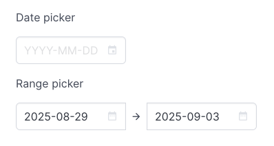
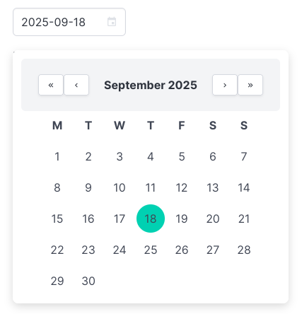
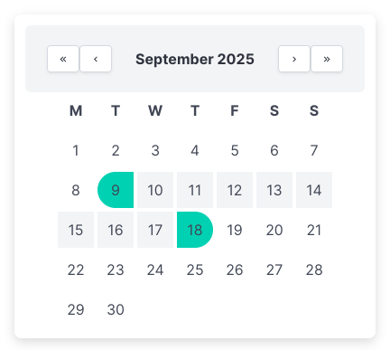

# BulmaDatePicker
My own Bulma date and range picker calendar input since I couldn't find anyone I liked.

## What it does

Choose a date or a date range from a input constructed from Bulma css elements.

## Requirements

- Bulma css framework
- MDI icons

## How to install

1. Clone the repo.
2. Copy `BulmaDatePicker.js` and `BulmaDatePicker.css` to your project.
3. Bulma css and mdi fonts are required. Include `<link rel="stylesheet" href="https://cdn.jsdelivr.net/npm/bulma@1.0.4/css/bulma.min.css">` and `<link rel="stylesheet" href="https://cdn.jsdelivr.net/npm/@mdi/font@6.5.95/css/materialdesignicons.min.css" />` in the head of your html file.
4. Include eg. `` and `<link rel="stylesheet" href="BulmaDatePicker.css">` in the head of your html file.

## Usage example

1. Create a div: `

`.
2. Initialize it in js: `const dateControl = new BulmaDatePicker(document.getElementById('dateControl'), options);`.

### Options table

| Option       | Type      | Default | Description                                                            |
| ------------ | --------- | ------- | ---------------------------------------------------------------------- |
| `range`      | `Boolean` | `false` | `false` = pick a single date. `true` = choose two dates, a date range. |
| `alwaysOpen` | `Boolean` | `false` | Turns the control into a permanent calendar.                           |

### Methods

| Method            | Description                                                                                                                                                   |
| ----------------- | ------------------------------------------------------------------------------------------------------------------------------------------------------------- |
| `.getValue()`      | Selected dates, either as a string or an array of strings depending on range option.                                                                          |
| `.setValue(value)` | Takes a string or array of two strings depending on range option. Sets the text of the input controls, and selects the date or date interval in the calendar. |
| `.clear()`  | Clears the text inputs and removes calendar selections. |

## Pictures

